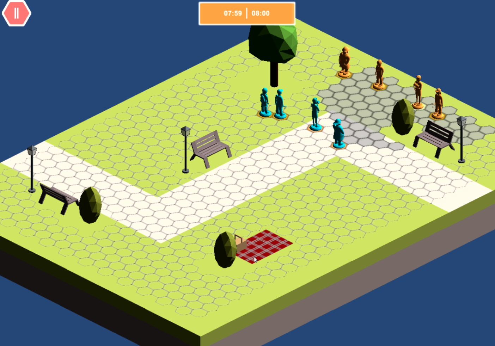
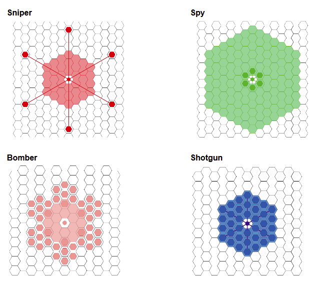

    

Keeping this one here until better place have been found.

I was working as a developer/programmer in a game project called [Toy Trail](http://www.toytrailgame.com/). It is a chess-like strategy game for children.

Rights were sold to **Mediaholvi osk**. I do not have rights to the product or code anymore. Here some old pictures and [video](https://youtu.be/2ItnT4k01Cs).

# Picture from Toy Trail.

    
    
    

- C#, Unity, local git, pelipaja.
- Effects [iTween](http://www.pixelplacement.com/itween/index.php).
- Lifesaver hexagon [tutorial](https://tbswithunity3d.wordpress.com/).

